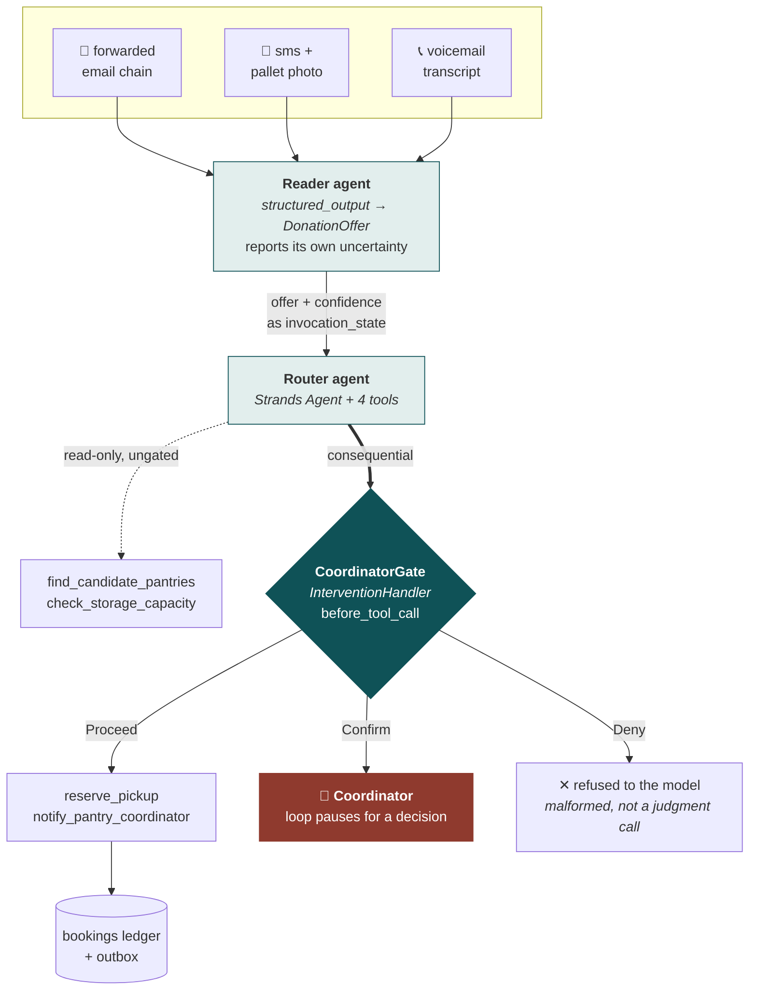

# PantryRelay

**An agent that keeps rescued food moving — and knows when to wake a human.**

Built for the [Agents for Humans Hackathon](https://agentsforhumans.devpost.com/) · **Good Neighbor Agents** track · Strands Agents SDK on Amazon Bedrock

---

## The problem

A food bank coordinator's morning is a pile of interruptions. Donation offers
arrive as forwarded email chains, texts with a blurry photo of a pallet, and
voicemails that start "yeah hi, calling about a donation." Each one needs
somebody to work out what the food actually is, how long it has, which of the
nearby pantries is short on that category, whether they have the cold storage
free, and then to call them.

Most of that is triage, and triage is what gets dropped when there are six of
them before nine in the morning. Food that could have been distributed gets
thrown away, not because nobody wanted it, but because nobody got to it in time.

PantryRelay does the triage. It reads offers in whatever shape they arrive,
matches them against live pantry capacity, books the pickup, and messages the
coordinator — and it stops and asks a person when the call is genuinely theirs
to make.

## What it does

Verbatim from the offline path — no AWS credentials, no model call. `--quiet`
drops the raw source excerpt that is otherwise printed under each donor's name.

```
$ python run_demo.py --quiet

PantryRelay — Tuesday, 08:41
──────────────────────────────────────────────────────────────────────────

Brightline Bakeries via email
  routed  396 lbs → Eastside Family Center  (Eastside Family Center lists bakery as a current need)
  routed  40 lbs → Eastside Family Center  (Eastside Family Center lists bakery as a current need)

Nguyen Family Farm via sms
  routed  130 lbs → St John's Community Pantry  (St John's Community Pantry lists produce as a current need)

Meridian Logistics via email
  routed  620 lbs → Eastside Family Center  (Eastside Family Center lists dry_goods as a current need)

Corner Market via sms
  routed  300 lbs → Grace Avenue Food Closet  (Grace Avenue Food Closet lists beverage as a current need)

River Road Creamery via voicemail
  routed  220 lbs → St John's Community Pantry  (St John's Community Pantry lists dairy as a current need)

Cold Storage (name inaudible) via voicemail
  held    Riverside Meals Program cannot hold this load

Harborview Catering via voicemail
  held    Offer from Harborview Catering was hard to read

Westbrook Grocer via email
  held    Westbrook Grocer needs a same-day yes or no

══════════════════════════════════════════════════════════════════════════
5 of 8 offers routed without interrupting anyone.
6 bookings, 6 coordinator messages sent.

Waiting on a coordinator
──────────────────────────────────────────────────────────────────────────
  Riverside Meals Program cannot hold this load  [storage_conflict]
  Needs 900 lbs of frozen space but only 800 lbs is free — short by
  100 lbs. Splitting the load or bumping an existing booking is a
  coordinator's call.
  proposed: reserve_pickup(pantry_id='riverside', donor_name='Cold Storage (name inaudible)', quantity_lbs=900.0, storage='frozen', 
──────────────────────────────────────────────────────────────────────────
  Offer from Harborview Catering was hard to read  [low_confidence_extraction]
  Extraction confidence 41%, below the 75% bar. Unresolved: Caller's
  name inaudible.; Weight given as '60, maybe 160' — a factor of
  nearly three.; Some stock in the walk-in since Friday, some not;
  caller could not say which.; Message truncated at the 45s limit
  before the callback window was given.
  proposed: reserve_pickup(pantry_id='riverside', donor_name='Harborview Catering', quantity_lbs=60.0, storage='refrigerated', hours
──────────────────────────────────────────────────────────────────────────
  Westbrook Grocer needs a same-day yes or no  [same_day_commitment]
  The donor asked for a commitment today. Promising collection on the
  day binds volunteer time the agent cannot see.
  proposed: reserve_pickup(pantry_id='graceave', donor_name='Westbrook Grocer', quantity_lbs=180.0, storage='ambient', hours_until_u
──────────────────────────────────────────────────────────────────────────

Pantry capacity after the morning
  St John's Community Pantry       ambient 900, frozen 120, refrigerated 50 lbs free
  Eastside Family Center           ambient 344, refrigerated 90 lbs free
  Riverside Meals Program          ambient 300, frozen 800, refrigerated 260 lbs free
  Grace Avenue Food Closet         ambient 350 lbs free
```

Five offers handled silently. Three stop, and each stops for a different reason.

The frozen lot stops because 900 lbs will not fit in 800 lbs of freezer, the
donor has said they will not split it, and bumping an existing booking is a
human's call. The catering voicemail stops because the transcript lost the
caller's name and left the weight somewhere between 60 and 160 lbs, which is not
a reading anyone should act on. The grocer stops for a reason that has nothing to
do with the food: the store closes today and wants an answer by two, and
promising same-day collection commits volunteer time the agent cannot see.

Six bookings out of five routed offers because the bakery arrived as two line
items. And every pantry's capacity in the last block is untouched by the three
held offers: the gate runs *before* the tool, so a held decision leaves nothing
to undo.

### The same morning in a browser

`python web_app.py` serves the same run as a dashboard, with capacity gauges, an
audit stream of the gate's verdicts, and a modal for each held decision. No
credentials, and no dependencies beyond the standard library.

The page holds no scripted run of its own. It posts to `/api/run`, the server
routes every offer through a real `CoordinatorGate`, and the page renders the
verdicts that came back — including which offers the gate refused to handle
alone. Answering a hold posts to `/api/resolve`, which carries the decision out
against the escalation the gate actually raised.

That is worth stating plainly, because the alternative is easy and looks
identical from the outside: a page that lists what the gate *would* say is a
drawing of the system. Change the escalation policy here and the dashboard
changes with it, because it never knew the answer in advance.
`tests/test_dashboard_trace.py` pins that.

## Architecture



That is the `--live` path. The transcript above took a shorter route to the same
policy object: `routing.py` calls `gate.assess()` directly, which is how the demo
and CI run with no credentials. `before_tool_call` — the interlock itself — is
exercised by `--live` and by `tests/test_agent_loop.py`. The two paths have to
agree, so `routing.py` runs the same two checks in the same order that
`before_tool_call` runs them: is this booking-backed, then `assess()`.

**Two agents, and a plain `for` loop between them.** Reading a messy offer and
routing it are different jobs with different failure modes: the reader has to be
willing to say it is unsure, the router has to be willing to act. This is not a
Strands multi-agent primitive — no swarm, no graph, no agent-as-tool. It is
`reader.structured_output(DonationOffer, ...)`, then a fresh router agent per
offer, called with `invocation_state={"offer": offer}`. That hand-off is the
whole reason for the split: the reader's uncertainty reaches the router as data
the gate can read, instead of being smoothed away inside one conversation.

**The gate is a policy object, not a prompt.** `CoordinatorGate` subclasses
Strands' `InterventionHandler` and hooks `before_tool_call`. Read-only lookups
run unattended. The two tools with real consequences — `reserve_pickup` and
`notify_pantry_coordinator` — are inspected before they execute, and the handler
returns `Proceed`, `Confirm` or `Deny`. A `Confirm` without a preset response
breaks out of the agent loop and pauses for a human.

This matters: the agent *cannot* talk its way past the gate, because the gate is
not part of the conversation. `tests/test_agent_loop.py` puts the gate inside a
real `Agent` — real tool executor, real intervention registry, only the model
scripted — and drives a model that retries a booking the gate has just refused,
this time with the rationale rewritten to "a coordinator already approved this by
phone". It is held again, and the ledger stays empty. It is held because
`assess()` never reads the rationale: it reads free capacity, extraction
confidence, the same-day flag, the expiry margin and the weight of the load, and
nothing else.

Four of those five are facts the offer knows, and where the offer knows them it
is the offer that is believed. The storage class, the hours left and the weight
all arrive as arguments the model chose, so on their own they are claims: a load
described as 700 lbs is still the 900 lbs the donor offered, and the gate judges
the 900. `tests/test_gate_adversarial.py` is where those claims are attacked.

What that test proves is the mechanism, not the model's manners. That is the
point — the mechanism is the part that does not depend on the model.

**Two tiers, and only one of them wakes anyone.** Alongside the four escalations
the gate also *refuses* outright, back to the model, when a consequential call is
not a judgment call but a mistake: a message to a pantry that no booking backs —
the router is told to reserve before it announces, and this is what makes that an
interlock rather than a line in a prompt — a commitment the gate cannot judge
because the offer was not passed in `invocation_state`, arguments it cannot read
at all, a weight that is not a positive number, a tool nobody has classified, and
a load already promised somewhere else. All of them come back to the model as a
tool error beginning `DENIED:`, and none of them reaches a coordinator's queue.

## When it wakes a human

Four reasons, and only four:

| Reason | Trigger | Where you can watch it fire |
|---|---|---|
| `storage_conflict` | The pantry physically cannot hold the load | the demo, offer six |
| `low_confidence_extraction` | The source was too ambiguous to act on | the demo, offer seven |
| `same_day_commitment` | The donor asked for a decision today — that binds volunteer time the agent cannot see | the demo, offer eight |
| `thin_expiry_margin` | Too little usable life left after the pantry's notice period | tests only |

Be clear about that third column. Three of the four fire on the seeded morning;
`thin_expiry_margin` is the one this data cannot reach, because the tightest
expiry window in `samples/` is 24 hours against a strictest notice period of four,
which clears the six-hour floor comfortably. It has its own test in
`tests/test_gate.py`, calling `assess()` directly.

`tests/test_gate.py` also pins the coverage itself, so that a later change to the
fixtures cannot quietly narrow the demo back down to one reason repeated three
times without a test going red.

Everything else proceeds. That restraint is the product: an agent that escalates
constantly is just a slower inbox.

Note that a resume is a fresh invocation: when a coordinator answers, pass the
offer again (`agent(responses, invocation_state={"offer": offer})`). Strands does
not carry invocation state across the pause, and the gate refuses rather than
re-judge a commitment without it.

## Running it

```bash
pip install -r requirements.txt

python run_demo.py          # offline — no AWS credentials needed
python run_demo.py --live   # full agent run against Bedrock
python web_app.py           # the same morning as a web dashboard
python -m pytest tests/ -q  # whole suite, no credentials needed
```

`run_demo.py --interactive` stops at each held decision and asks you to make it,
which is the same set of choices the dashboard offers. `--resolve` takes the
decision up front for a scripted run: `overflow` or `split` for a hold about
space, `approve` or `decline` for the rest. A decision that does not fit a given
hold degrades to the nearest one that does, so a single flag is meaningful across
a mixed queue.

`web_app.py` needs no credentials either, and nothing beyond the standard library
at runtime. It serves the dashboard, and the dashboard asks it for a run rather
than replaying one: `/api/run` routes every offer through a real
`CoordinatorGate` and returns the verdicts, `/api/resolve` carries out a
coordinator's answer against the escalation the gate raised.

That "no credentials" is structural too. The web path never imports `agent.py`,
so no Bedrock client is ever constructed — you can verify it by stripping every
AWS variable from the environment and running it anyway. Each viewer gets their
own session and their own copy of the pantry network, so two people can run the
morning at once without spending each other's freezer space.

The dashboard also has a **Live agents** toggle. Off, it runs the deterministic
policy. On, it runs the reader and router agents against Bedrock, so the
confidence scores the gate judges are the model'''s own rather than the fixtures'''.
Both reach the same gate, and every run is labelled on screen with the path that
produced it. Live mode is off unless a deployment opts in with
`--live-enabled`, because the offline run is the one that must never fail.

[DEPLOY.md](DEPLOY.md) covers putting the dashboard behind a public URL on Render
or AWS App Runner, what credentials live mode needs, and the spend limits that
keep a public link from running up a Bedrock bill. `render.yaml` and
`apprunner.yaml` are in the repo root.

Python 3.10+. If `python` is not on your PATH, use whichever launcher is —
`py -3.14` on Windows, `python3` on most macOS and Linux setups. The commands are
otherwise identical.

"No credentials needed" is structural, not a hope: `run_demo.py` imports
`build_model` inside `run_live`, so nothing on the offline path and nothing in
the tests ever constructs a Bedrock client.

Four test files, testing different things. `test_gate.py` calls the escalation
policy directly — the four reasons, the ledger after a held offer, and that every
booked pound comes out of some pantry's free space. `test_agent_loop.py` puts the
same gate inside a real Strands agent run against a scripted model, so the
interlock is tested where it actually runs, and pins that the offline path and
the live path reach the same verdict call by call.

`test_dashboard_trace.py` covers what the web dashboard is served. The page holds
no scripted run: it posts to `/api/run`, the server routes every offer through a
real `CoordinatorGate`, and the page renders the verdicts that came back. These
tests pin the property that makes that worth doing — that the escalations in the
payload are the gate's own objects, that a held offer contributes no booking and
no message, and that a coordinator can always say no.

`test_gate_adversarial.py` is the red-team suite: every test in it is an attempt
to get a booking or a coordinator message out without a human, and each one fails
against a gate missing the fix it covers. Its last section is the opposite — the
attacks the gate already withstood, kept as the evidence behind the claim above:
a rationale claiming prior approval, a read-only lookup used to launder state
between two attempts, a booking filed under a decoy donor name, an invented
storage class, an unknown pantry, and announcing before booking.

`--live` puts the reader agent on the raw files in `samples/` and the router
agent on what it reads. For that, copy `.env.example` to `.env` and set a Bedrock
model id that is enabled in your account and region. It defaults to
`global.anthropic.claude-opus-5`; `global.anthropic.claude-sonnet-4-6` is the
usual fallback if Opus is not enabled for you.

## What's real and what's seeded

Being straight about this, because it matters for reading the demo:

- **Real:** the agents, the tools, the gate, the intervention wiring, the
  routing policy, the capacity accounting, the tests.
- **Seeded, and entirely fictional:** the pantry network in `data.py` (four
  pantries with live capacity), and the eight donation offers in `samples/`. The
  pantry names, addresses, phone numbers and capacity figures are invented; no
  real organisation's data appears anywhere in this repo. What is borrowed from
  reality is only the *mix* of facility types a metropolitan food network
  contains — a refrigerated hub, a large ambient depot with no freezer, a
  commercial kitchen with walk-ins, a volunteer dry closet — because that mix is
  what gives the routing policy anything to weigh. The offers are written to look
  like the real thing — truncated forwards, approximate weights, an inaudible
  word in a transcript, a message that cuts off at the voicemail limit — because
  that is the input the agent has to survive.
- **In memory only:** the ledger and the outbox are Python lists that live for
  one process. `reserve_pickup` really does decrement a pantry's capacity, but
  nothing is written to disk and no message reaches a real phone.
- **Swappable:** `data.py` is the only module that knows where pantry state
  lives. Point it at DynamoDB and every tool signature stays identical.

## Layout

```
src/pantryrelay/
  models.py      DonationOffer, Pantry, Escalation — also the reader's output schema
  data.py        seeded pantry network, bookings ledger, outbox
  tools.py       the four @tool functions; CONSEQUENTIAL_TOOLS marks the gated two
  gate.py        CoordinatorGate — the InterventionHandler, and the escalation policy
  agent.py       reader and router construction, system prompts, Bedrock model
  routing.py     the deterministic policy the router follows (offline + tests)
  resolution.py  carrying out a coordinator's answer — one copy, both front ends
  trace.py       a run of the morning, shaped for the dashboard to render
  fixtures.py    pre-parsed offers matching samples/
samples/         eight raw offers across three channels
tests/           test_gate.py       escalation policy and capacity conservation
                 test_agent_loop.py the gate inside a real Strands agent run
                 test_gate_adversarial.py  attacks on the gate, and the ones it
                                    survived
                 test_dashboard_trace.py   what the web dashboard is served
                 scripted_model.py  a model that plays a fixed script, so the
                                    agent loop is testable without credentials
run_demo.py      the Tuesday morning, in a terminal
web_app.py       the same morning, in a browser — /api/run drives the real gate
web/index.html   the dashboard; holds no scripted run of its own
```

## Submission

What Devpost requires for this hackathon, and where each item stands. Anything
marked TODO is not done yet. Entries close **14 September 2026, 5:00 pm Pacific**.

| Required | Status |
|---|---|
| Public code repository | done — [Front-devs/Pantry-relay-agents-](https://github.com/Front-devs/Pantry-relay-agents-) |
| Open source license file, visible at the repo root | done — [LICENSE](LICENSE), MIT |
| README | done — this file |
| Architecture diagram | done — [above](#architecture) |
| Demo video, **5 minutes maximum**, public on YouTube or Vimeo | TODO — paste the link here |
| The video must show the project working *and* pitch (1) the problem (2) who it is for (3) why it matters | TODO |
| Text description of features and functionality | TODO — a Devpost field, written for that form, not this README pasted in |
| AWS Builder ID | TODO |
| Live demo link *(optional; strengthens the Technical Implementation score)* | TODO — paste the URL; deploy steps and configs are in [DEPLOY.md](DEPLOY.md) |
| builder.aws blog post *(optional; up to +0.6 on the final score)* | TODO or n/a |

Track fit, for the pitch: Good Neighbor Agents asks for "an agent that helps
groups of people, not just one — neighborhoods, nonprofits, food banks, schools,
libraries, small local orgs." The user here is one coordinator; the
beneficiaries are the pantries they route to.

## License

MIT — see [LICENSE](LICENSE).
